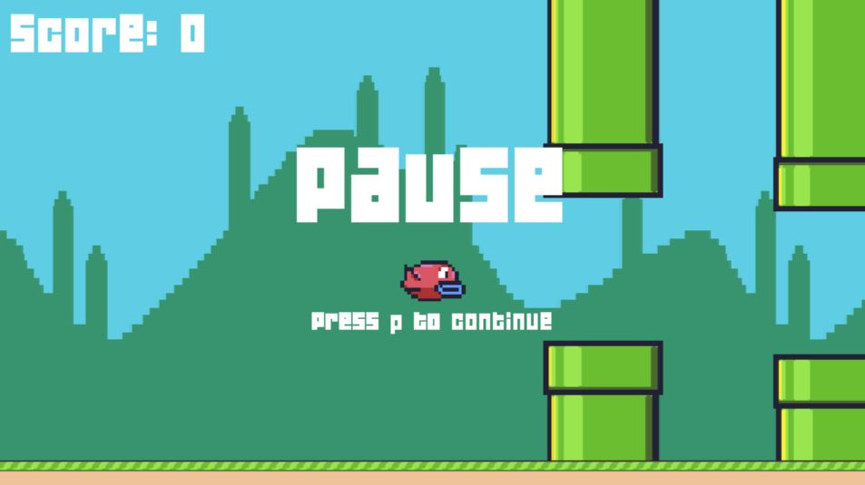
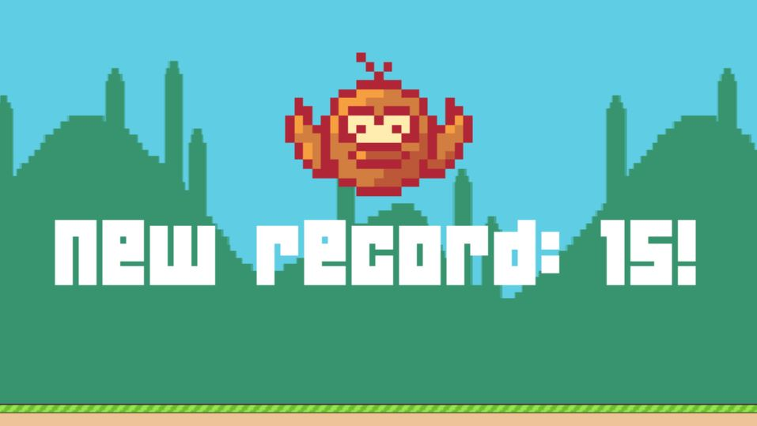

# Flappy-bird2.0

Happy flappy bird must come back to its nest! Help this little one to fly between as many pipes as you can and win medals for distance. Be careful with those pipes!

## How to play

This game has been developed in Lua, so you will need some special arrangements for using it. Don't worry though, you will have it working in no time with a very light program: Löve2D.

1. In order to get Löve2D installed and running, please visit the link: https://love2d.org/wiki/Getting_Started and follow the instructions. Basically, download the most suitable Löve2D version for your device (it will just take a few seconds) and... that's all. If you double click on the Löve2D icon, a new window will be open with a little balloon of a duck with the legend "NO GAME". Everything good until now ╰(*°▽°*)╯.

2. Now, open the git bash in your device and travel to the most convenient location to place the project. In my case, I would like to place it in my desktop:

```
cd desktop
```

2. Execute the clone command of git, and the folder with the project will be created and completely loaded in your current location (desktop in my case). So in the git bash I would execute the command:

```
git clone https://github.com/juliagarlor/flappy-bird.git
```

3. Now, the game engine is ready and the file containing our project has been downloaded. Everything is in place, so now take the project folder and drag it to the Löve2D icon. When you drop the folder in the icon, a new window should be open with the opening view of the game. Press Enter and enjoy!



## Thanks ❤

Special thanks to the team of CS50 of Harvard University, without whom I wouldn't have been able to develop not only this project but my passion for videogames programming. 

Please, make sure to check the lecture to develop this project in the following link: https://youtu.be/3IdOCxHGMIo

Regarding to this flappy-bird version, any feedback for improvement is welcome, and I hope you have fun using it.



Developed with ❤ by Julia García
